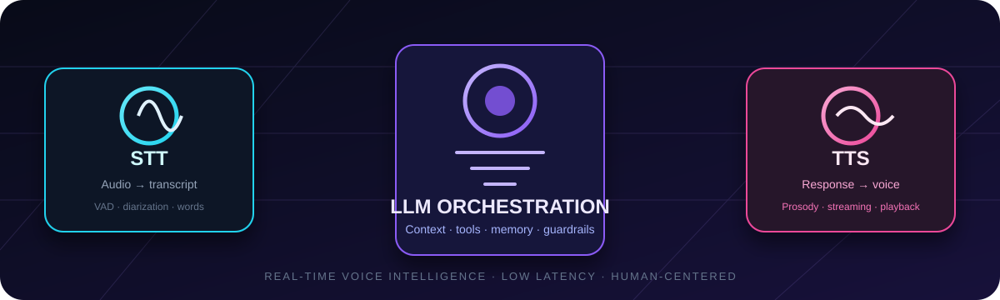
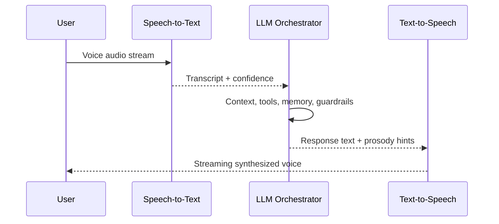

  

  
  
  

# Atulya Pratap Suryavanshi

> **Software developer at Bridzo** building dependable AI products, voice interfaces, and backend systems that turn complex workflows into clear human experiences.

I work at the intersection of **artificial intelligence, backend engineering, real-time communication, and product architecture**. My focus is not only on making models respond; it is on designing the complete path from an imperfect human signal to a useful, safe, and fast product experience.

## What I build

| Area | How I think about it | Outcome |
| --- | --- | --- |
| **Voice AI** | Speech is captured, understood, reasoned over, and returned as natural audio. | Conversational interfaces that feel immediate and purposeful. |
| **LLM systems** | Models sit inside orchestration, context, tools, memory, and guardrails. | AI features that can operate inside real product workflows. |
| **Backend platforms** | APIs, data, auth, and business logic should be observable and resilient. | Systems that remain useful after the prototype stage. |
| **Product engineering** | A good architecture must still be simple enough for people to use. | Clear, accessible products with a strong technical core. |

## Voice AI, end to end

A production voice experience is a **three-stage system**: capture the signal, make a grounded decision, and return an intelligible response. The visual below maps that path as an observable stream rather than a black box.

  
   
  <b>Signal in → intelligence in context → natural response out</b>

### The data flow

1. **STT — listen.** Audio enters through a microphone or stream. Voice activity detection isolates speech, and speech-to-text converts the signal into a timestamped transcript.
2. **LLM — understand and act.** The transcript is normalized, enriched with conversation context, and routed through an LLM orchestration layer. This is where intent, tool calls, memory, validation, and safety policies belong.
3. **TTS — respond.** The response is shaped for speech rather than merely displayed as text. Text-to-speech adds prosody and streams the result back to the listener with low perceived latency.
4. **Feedback — improve.** Telemetry can measure latency, interruption rate, transcript quality, task completion, and user feedback without treating raw conversation data as an afterthought.

## Selected achievements

The strongest evidence of my work is in the systems I have shipped and explored publicly. These highlights are intentionally grounded in the projects visible on my GitHub profile rather than inflated with unsupported claims.

### MSME Jaankari — information platform

Built a premium Indian MSME information platform concept with public scheme discovery, expert guidance, subscriptions, alerts, and an administrative management portal. The project shows my interest in turning fragmented information into a product with clear user journeys and operational tooling.

**Project:** [Atulya180399/msme-jaankari](https://github.com/Atulya180399/msme-jaankari)

### DotBridge — full-stack product surface

Worked across a Python backend and JavaScript frontend split into separate repositories, reflecting a practical full-stack approach: keep product interfaces independently evolvable while giving the service layer a clear boundary.

**Projects:** [dotbridge-backend-sql](https://github.com/Atulya180399/dotbridge-backend-sql) · [dot-bridge-frontend](https://github.com/Atulya180399/dot-bridge-frontend)

### A builder's operating principle

> Start with the user signal, make the system legible, and keep the architecture ready for the next real constraint.

## Technical constellation

  

| Layer | Tools and patterns |
| --- | --- |
| **Languages** | Python, TypeScript, JavaScript, SQL |
| **AI layer** | STT pipelines, LLM orchestration, prompt design, TTS and streaming audio concepts |
| **Application layer** | React, Node.js, REST APIs, responsive product interfaces |
| **Data and delivery** | SQL-backed systems, Git/GitHub workflows, modular service design |

## How I approach a new system

**Discover.** I clarify the human problem, the latency budget, the data boundaries, and what “working” means for the first user.

**Design.** I separate the experience layer from the orchestration layer, then make the important paths observable: input quality, model decisions, tool calls, output quality, and failure recovery.

**Build.** I prefer small, testable interfaces between services and a feedback loop that lets the product improve without rewriting its foundation.

**Ship.** I treat documentation, sensible defaults, deployment hygiene, and maintainability as part of the product—not as work left over after the demo.

## Beyond the profile

I am currently interested in **real-time voice agents, multimodal interfaces, useful automation, and the engineering discipline required to move AI from a clever response to a dependable capability**. If you are building in that space, the best way to reach me is through [GitHub](https://github.com/Atulya180399).

   
  

<!--
  Profile facts used in this README are based on the public GitHub profile and public repositories:
  https://github.com/Atulya180399
-->
